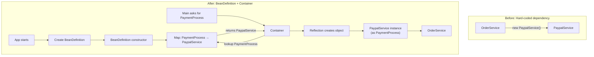

# The problem Spring solves
easy right ? 
let's see :) 

imagine you are building an e-commerce backend, and you have OrderService that needs to process payments

the naive approach is: inside the OrderService you write for example

```java
PaymentProcess process = new PaypalService();
```

if your boss comes and says "we're switching the contract from PayPal to Stripe" what do you have to do to your code?

The answer is use an interface

```java
public interface PaymentProcess {
	void pay(double amount);
}
```

and the OrderService looks like

```java
public class OrderService {

    private final PaymentProcess paymentProcess;

    public OrderService(PaymentProcess payment) {
        this.paymentProcess = payment;
    }

    public void checkout() {
        paymentProcess.pay(100.00);
    }
}
```

and PayPal or Stripe services look like

```java
public class PaypalService implements PaymentService {

	@Override
	public void pay(double amount){
		System.out.println("Paying " + amount + " € using PayPal");
	}
}
```

the same for Stripe service

#### so now in the main class we create a new orderservice

```java
public class Main {
    public static void main(String[] args) {

        PaymentProcess paymentProcess = new PaypalService();

        OrderService orderService = new OrderService(paymentProcess);
        orderService.checkout();
    }
}
```

#### so spring container's job is to eliminate that line of code

```java
PaymentProcess paymentProcess = new PaypalService();
```

==> so we want the _Container_ to call that constructor for us automatically

### The Missing Piece: Configuration

so the problem here is like we indicated before if your company doesn't support PayPal for any reason like boycott or any other reason you should delete it from the main and from the OrderService

so the idea is creating a class let's call it BeanDefinition it will act like a configuration file "yes i know we should use xml file or annotation" but for mini-spring v01 we'll use a class that contains a hashMap; key,value so the constructor of this class BeanDefinition will put as a key the PaymentProcess and as a value PaypalService

and now it's easy if we want to change the PaypalService to StripeService, we'll change it once => in this configuration file ok!

so the config class looks like

```java
public class BeanDefinition {  
    Map<Class<?>, Class<?>> beanMapping = new HashMap<>();  
  
    public BeanDefinition(){  
        beanMapping.put(PaymentProcess.class, PaypalService.class);  
    }  
}
```

good now we did the config file but we're not done yet we should have the **bridge** between the config file (BeanDefinition) and the main method so we call it container: yep it's like the spring container not really but you get the idea ;)

so the main method asks the container "I need a PaymentProcess" the container takes the request to the BeanDefinition map it looks up the key `PaymentProcess` and finds the value `PaypalService`

So the container creates the PaypalService **magically**! yep it's the **Reflection concept**

### OK! but what is java reflection

ok so this blog is not to deep dive into java reflection but think about it like the ability to manipulate java classes at runtime so when you do

```java
Class<?> c = myClass.class;
// so c it's not a copy of myClass or something else
// it's a reflection of it
// like a mirror
// it's not like
myClass mc = new myClass();
// but c == mc is true!
```

read more about java reflection [here](https://www.oracle.com/technical-resources/articles/java/javareflection.html)

---

Nice now when you understand the reflection let's move on to the master piece of our program which is the container or the IOC container like spring ;)

so the role of the container is the creation of the object in this case we want the paypalService created inside the container not inside the main remember ;)

before we write code the method that will create the container should:

- get an interfaceClass input of type Class < ? > in our case it's PaymentProcess (why interfaceClass? cuz in the future we'll have not just PaypalService)
- and then we go to our map and get the value and store it in an object class too
- then using reflection like you learned to create an instance from it

```java
public class MiniContainer {  
    BeanDefinition config = new BeanDefinition();  
  
    public Object getBean(Class<?> interfaceClass) {  
        Class<?> myClass = config.beanMapping.get(interfaceClass); // so when we do map.get(key) we get the value: in this case it's paypal  
  
        if (myClass == null) {  
            throw new RuntimeException("Bean not found!");  
        }  
        Object object;  
        try {  
            Constructor<?> constructor = myClass.getDeclaredConstructor();  
            object = constructor.newInstance();  
        } catch (Exception e) {  
            throw new RuntimeException(e);  
        }  
        return object;  
    }  
}
```

### and boom you now created your own spring v01

small test :) 'malk mkhlo3 HHH'

the result is true or false? and why

```java
public class Main {  
    public static void main(String[] args) {  
  
        MiniContainer miniContainer = new MiniContainer();  
  
        PaymentProcess p1 = (PaymentProcess) miniContainer.getBean(PaymentProcess.class);  
        PaymentProcess p2 = (PaymentProcess) miniContainer.getBean(PaymentProcess.class);  
  
        System.out.println(p1 == p2);  
    }  
}
```

send me a message if you did it :) [message](mailto:ayoubmahjouby@gmail.com?subject=blog%20answer&body=hello%20ayoub%20this%20is%20the%20answer%3A)

and of course check the [github-repo](https://github.com/ayoubMah/Mini-Spring)



